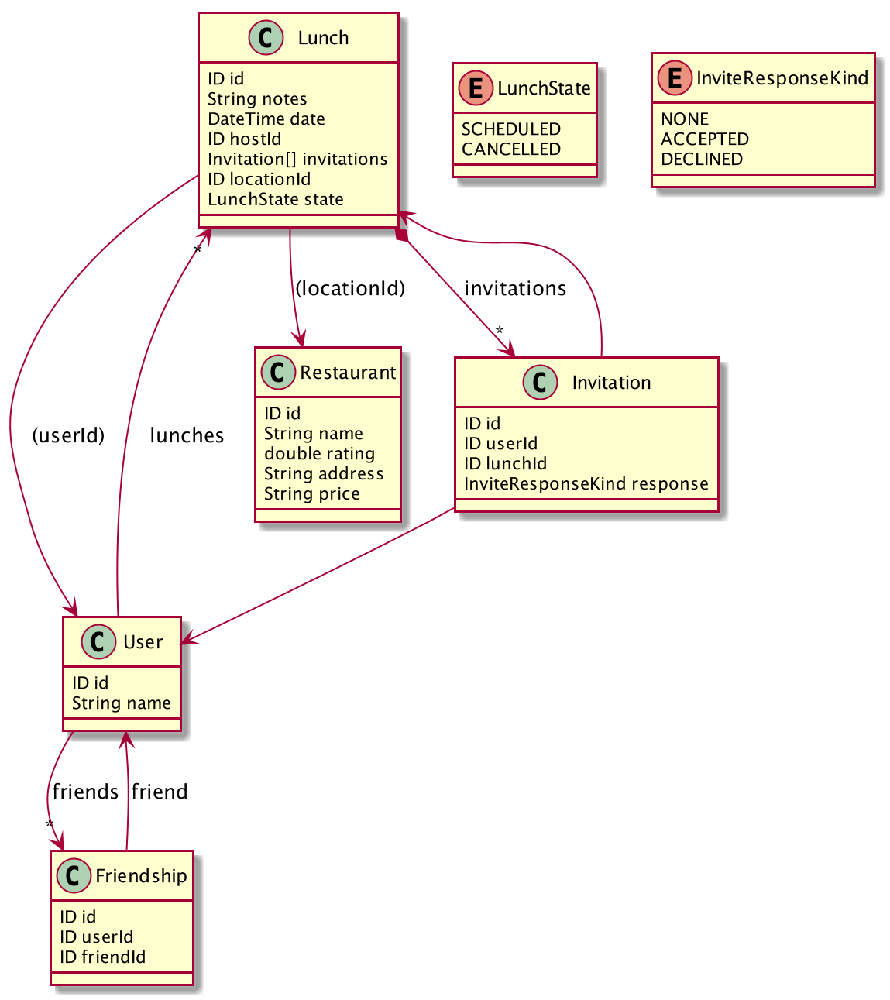

# Lunch Scheduler App

* Vorlage unter https://github.com/microsoft/Windows-appsample-lunch-scheduler
    * C# Code - ist für Java-Entwickler typischerweise verständlich
    * Ihr könnt immer nachschauen, wie es umgesetzt wurde
    * Hoffentlich wenig Unklarheit bei Fachlichkeit    
* In diesem Workshop soll nur das Backend erstellt werden.
* Integration mit externen Diensten (Facebook, ...) wird nicht behandelt 
* Entscheidungen bzgl. der Rest-API werden übernommen - auch wenn es vielleicht anders schöner wäre
    * Kleinere Anpassungen/Erweiterungen sind notwendig weil ansonsten die Anwendung ohne externe Services nicht funktioniert
    * Einige Features (Gruppen) werden nicht umgesetzt
    
# Rest-API und Entitäten
* extrahiert und vereinfacht aus dem C# Code
* Authentification passiert über Http-Basic. Name entspricht `User.name`. Passwort egal.

## Entitäten
* `User` hat nur einen Namen und keine Foto
* `Restaurant`hat keine Geolocation. Suche soll via `like` im `address` String erfolgen.
 
     

## Controller
* Funktion `User MeController.get()` ist zusätzlich, da der `LoginController` nicht umgesetzt wird. Das Anlegen der User erfolgt
im Code, d.h. es gibt keine Möglichkeit über die API neue User anzulegen.
* Funktion `FriendsController.get()` soll anders als im Original alle User die noch keine Freunde sind zurückgeben. 
Im Original gibt diese nur User zurück, mit denen man in der Vergangenheit zum Lunch war und die noch keine Freunde sind
* Unter [OpenApi-Spec](models/LunchScheduler.v1.yaml) findet man auch noch eine andere Beschreibung der API. Unter https://stoplight.io/studio/ kann man das File auch mit UI importieren/untersuchen/bearbeiten.

     

## Wichtige Abläufe
### Freunde zuordnen
1. `MeController.get()` holt über Authentication-Infos den eigenen `User`
2. `FriendsController.get()` holt  Nicht-Freunde
3. `FriendsController.add()` fügt neuen Freund hinzu
4. `MeController.friends()` holt aktuelle Freunde

### Lunch organisieren
1. `MeController.get()` holt über Authentication-Infos den eigenen `User`
2. Mit `MeController.friends()` oder `FriendsController.get()` andere User holen
3. Mit `Restaurants.get()` Restaurant suchen
4. `LunchController.post()` erzeugt Lunch

### Einladung annehmen oder absagen
1. `MeController.invitations()` holt alle offenen Einladungen
2. `Invitation.reponse` ändern
3. `InvitationController.post()` ändert die Einladung

### Lunches einsehen oder absagen
1. `MeController.lunch()` holt eigenen und zugesagte Lunches
2. `Lunch.state` ändern und mit `LunchController.post()` abspeichern
3. oder `Invitation.reponse` ändern und mit `InvitationController.post()` abspeichern

  